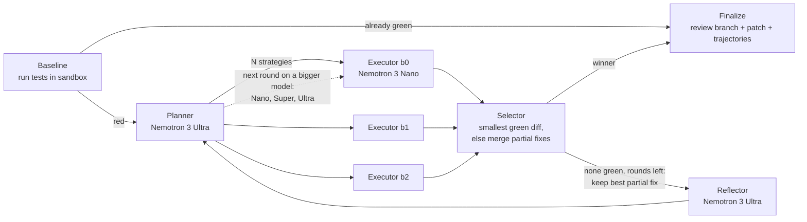

<div align="center">

# 🍴 Fork: Red to Green

**A coding agent that turns failing tests green by trying several fixes in parallel, in forked cloud sandboxes, and keeping the smallest one that passes.**

[](https://github.com/Maukthik/codefork/actions/workflows/tests.yml)


*Nebius x NVIDIA Global AI Hackathon, **Coding and Agentic Engineering** track*

**[Demo video](#) · [Live demo](#)**

</div>

---

## What it does

Point Fork at a repo with failing tests. It:

1. **Plans.** NVIDIA Nemotron 3 Ultra reads the code and the failing output and proposes *N genuinely different* fix strategies.
2. **Forks.** The repo is uploaded once as a Nebius sandbox checkpoint. Every strategy gets its own branch that forks from that checkpoint, so branches run in parallel and never see each other's edits.
3. **Executes.** In each branch, Nemotron 3 Nano edits files (snippet edits or whole files) and the tests re-run automatically after every edit, in the sandbox. A branch that stops making progress (repeating the same edit, or not editing at all) gets one nudge, then is ended so it stops spending tokens.
4. **Judges.** A branch is green only when the *original, untouched* tests pass (see [tamper guard](#tamper-guard)). The first green branch cancels the others.
5. **Merges partial fixes.** If no branch is green but several fixed *different* bugs in *different* files, their changes are combined and judged, with no extra model calls. Often that alone turns the suite green.
6. **Escalates.** Otherwise Nemotron 3 Ultra explains what went wrong, and the next round starts from the best partial fix so far (not from scratch) on a bigger model: Nano, then Super, then Ultra.
7. **Hands you a review branch.** The smallest passing diff is committed to `fork/fix-<run>` in your repo using a temporary git worktree. Your checkout is never touched until you approve.

A real run on the included invoice demo: 3 parallel branches, all green, 10-line winning diff across 2 files, about 57k tokens, **about one US cent**.

## How it works



Built as a [LangGraph](https://github.com/langchain-ai/langgraph) `StateGraph`. The parallel fan-out uses `Send`, one per strategy.

| Piece | File |
|---|---|
| Graph, nodes, sandbox, tamper guard, cost tracking | `agent_graph.py` |
| Streamlit UI: run, watch live, compare branches, approve or reject; hosted demo mode | `graph_app.py` |
| Hosted demo helpers: demo repos, GitHub import, access code, spend caps, replays | `hosting.py` |
| Offline tests (fake LLM, fake sandbox, headless UI tests): 83 tests | `test_agent_graph.py`, `test_hosting.py` |
| Demo repos with planted bugs: `invoice` (3 bugs, 2 files), `bookstore` (7 bugs, 5 modules) | `examples/` |

## How NVIDIA Nemotron and Nebius are used

| | What | Why |
|---|---|---|
| **Nemotron 3 Ultra** (`nvidia/Nemotron-3-Ultra-550b-a55b`) | Planner and reflector | Few calls, needs the best reasoning: root-cause hypotheses and failure analysis |
| **Nemotron 3 Nano** (`nvidia/NVIDIA-Nemotron-3-Nano-30B-A3B`) | Executor, round 1 (the many edit and test turns) | Fast and cheap, so trying 3 strategies in parallel costs less than one big-model attempt |
| **Nemotron 3 Super** (`nvidia/nemotron-3-super-120b-a12b`) | Executor, round 2 (escalation) | Only paid for when Nano couldn't finish |
| **Nemotron 3 Ultra** as executor | Round 3 (escalation) | Last resort for the hardest remaining bugs |
| **Nemotron reasoning switch** | `chat_template_kwargs` `enable_thinking` / `low_effort` | Executor runs with thinking `off` or `low` for speed; falls back cleanly if unsupported |
| **Nebius Token Factory** | OpenAI-compatible inference for every model call | One endpoint for all three Nemotron sizes |
| **Nebius Token Factory Sandboxes** (`contree-sdk`) | Every test and command runs in an isolated cloud sandbox | The repo becomes one checkpoint and each branch overlays only its changed files, so parallel branches are cheap and isolated |

Every run reports tokens and **USD cost per stage**, and you can cap spend per run (`--max-usd`).

## Results on Nebius

Real runs with Nemotron 3 on Token Factory and Nebius Sandboxes, 3 parallel branches. Both 1 Oct runs are in `examples/recorded/` and can be replayed in the app.

| Date | Demo | Result | What happened | Cost |
|---|---|---|---|---|
| 30 Sep | `invoice` (3 bugs, 2 files) | green, 1 round | Nano fixed both files, but the winning diff was a 27-line refactor | $0.011 |
| 30 Sep | `bookstore` (7 bugs, 5 modules) | green, 2 rounds | Round 1 on Nano reached 17/18 tests; round 2 on Super started from that partial fix and finished in 2 turns. The tamper guard refused an edit to `tests/test_orders.py`. Logs showed Nano repeating one edit 10 times and fighting `/app/...` paths | $0.056 |
| 1 Oct | `invoice` | green, 1 round | After the minimal-change prompts: all 3 branches green in 3–4 turns, winning diff **10 lines** | $0.012 |
| 1 Oct | `bookstore` | green, 2 rounds | Stuck branches now end early (6 turns instead of 15) and executor spend fell. Round 2 on Super fixed the last bug in **1 turn** | $0.084 |

**What the numbers taught us.** On 1 Oct, Ultra's reasoning tokens in planning and reflection were 68% of the bookstore cost ($0.058 of $0.084): the reflector wrote 7,889 tokens to produce a 150-word note. Reasoning "low" barely changed that, so planning and reflection now run with reasoning **off**, and the planner splits independent bugs across branches so partial fixes can be merged.

## Hosted demo

The same Streamlit app runs as a public demo with `HOSTED=1`:

- **Replay a recorded run** (default, free): real Nebius runs from `examples/recorded/`, played back step by step with every branch, cost and the final patch. No model calls.
- **Run live** on a bundled demo repo or **any small public GitHub repo** (downloaded as a zip, up to 400 files). Each visitor gets a fresh copy; the fix comes back as a downloadable `git apply`-able patch.
- **Spending is bounded:** live runs need an access code (`DEMO_ACCESS_CODE`), each run has a hard cap (`HOSTED_MAX_USD_PER_RUN`), the whole demo has a daily budget (`DAILY_BUDGET_USD`), and only one live run happens at a time.
- The "local" sandbox is never offered; every command runs in Nebius Sandboxes.

**Deploy on Streamlit Community Cloud:** New app → this repo, branch `main`, file `graph_app.py`, Python 3.12 → Advanced settings → paste `.streamlit/secrets.toml.example` filled in → Deploy.

## Tamper guard

An agent that is rewarded for green tests will, sooner or later, "fix" the tests. Fork makes that impossible to win with:

- **Read-only tests.** Writes to `test_*.py`, `*_test.py`, `conftest.py`, `tests/`, `pytest.ini`, `pyproject.toml` and similar are refused.
- **Restore before judging.** Before every test run that counts, protected files are restored from the original repo. Edits made through shell commands are undone, and new files such as a `conftest.py` that deselects everything are deleted.
- **Only the judge decides.** The model's own test runs are informational. `pytest -q || true` exiting 0 doesn't make a branch green.
- **No skipping your way out.** For pytest, at least as many tests must pass as existed at baseline, so skipped or deselected tests don't count.
- **Visible.** Refused and reverted edits are counted per branch and shown in the UI and the run summary.

Each rule has a test in `test_agent_graph.py`.

## Quickstart

```bash
git clone https://github.com/Maukthik/codefork.git && cd codefork
python -m venv .venv
source .venv/bin/activate            # Windows: .venv\Scripts\activate
pip install -r requirements.txt

cp .env.example .env                 # Windows: copy .env.example .env
# fill in NEBIUS_API_KEY and NEBIUS_PROJECT_ID
python scripts/list_models.py        # check your key and the exact Nemotron model ids
python scripts/hello_sandbox.py      # check the Nebius sandbox works

python scripts/make_demo.py          # creates workspace/invoice (3 bugs) and workspace/bookstore (7 bugs)
```

**Web UI**

```bash
streamlit run graph_app.py
```

**CLI**

```bash
python agent_graph.py --repo workspace/invoice --branches 3 --rounds 2 --max-usd 0.25
python agent_graph.py --repo workspace/bookstore --branches 3 --rounds 3 --ladder nano,super,ultra --max-usd 0.50
git -C workspace/invoice diff main fork/fix-<run_id>     # review
git -C workspace/invoice merge fork/fix-<run_id>         # accept
```

| Flag | Default | Meaning |
|---|---|---|
| `--branches` | 3 | Parallel strategies per round |
| `--rounds` | 2 | Plan, execute, reflect cycles |
| `--ladder` | `EXECUTOR_LADDER` | Executor model per round, e.g. `nano,super,ultra` |
| `--max-turns` | 15 | Model turns per branch |
| `--thinking` | model default | Executor reasoning: `on`, `low`, `off` |
| `--all-branches` | off | Let every branch finish instead of stopping at the first green one |
| `--max-usd` | `MAX_USD_PER_RUN` | Stop starting new model calls after this spend |
| `--apply` | off | Also copy the fix into the working tree |
| `--no-branch` | off | Patch file only, no git branch |

## Output

| Path | Contents |
|---|---|
| `fork/fix-<run_id>` branch in the target repo | The winning fix, with strategy, diff size and test result in the commit message |
| `logs/graph_<run_id>.json` | Summary: status, every branch, tokens and USD by stage, tamper attempts |
| `logs/graph_<run_id>_winner.patch` | The fix as a `git apply`-able patch |
| `logs/trajectories/*.json` | Full conversations of green branches (fine-tuning data); red ones in `failed/` |

## Configuration

All settings live in `.env` (see `.env.example`). The important ones:

| Variable | Default | |
|---|---|---|
| `NEBIUS_API_KEY`, `NEBIUS_PROJECT_ID` | – | Token Factory key and project (the project is needed for sandboxes) |
| `PLANNER_MODEL`, `EXECUTOR_MODEL`, `REFLECTOR_MODEL` | `NEBIUS_MODEL` | Model per stage (aliases `nano`, `super`, `ultra` work) |
| `EXECUTOR_LADDER` | – | Executor model per round; overrides `EXECUTOR_MODEL` |
| `EXECUTOR_THINKING`, `PLANNER_THINKING`, `REFLECTOR_THINKING` | model default | `on`, `low` or `off` per stage |
| `EXECUTOR_STALL_LIMIT`, `EXECUTOR_IDLE_LIMIT` | 3, 6 | End a branch after this many edits without progress / turns without edits |
| `SANDBOX` | `nebius` | `local` runs commands on your machine. Only for tests and trusted repos; hidden in the UI unless `ALLOW_LOCAL_SANDBOX=1` |
| `SANDBOX_IMAGE` | `python:3.12-slim` | Base image for the sandbox checkpoint |
| `MAX_USD_PER_RUN` | no cap | Default spend cap |
| `PRICES_JSON` | Nano $0.06/$0.24, Super $0.30/$0.90, Ultra $1/$3 per 1M tokens | Override the price table |

## Tests

```bash
python -m pytest -q
```

83 tests. They script the model's replies and fake the Nebius sandbox, so they need **no API key, no network and no credits**, and they run in CI on every push. They cover the graph (branching, reflection, first-green cancellation, budget cap, escalation, partial-fix merging, carrying progress between rounds), the tamper guard, the Nebius checkpoint and overlay logic, git review branches, patch output and line endings, concurrent runs keeping separate logs, sandbox retries, GitHub zip import (size limits, path-traversal checks) and the Streamlit app itself, driven headless with `streamlit.testing`.

## Project layout

```
.
├── agent_graph.py          # the agent (LangGraph)
├── graph_app.py            # Streamlit UI (local and hosted)
├── hosting.py              # hosted demo: repo import, access code, budgets, replays
├── test_agent_graph.py     # offline agent tests
├── test_hosting.py         # hosting + headless UI tests
├── examples/               # demo repos with planted bugs; recorded/ = replayable runs
├── .streamlit/             # app config and secrets template
├── scripts/                # make_demo, list_models, connectivity checks
├── legacy/                 # first single-agent version (planner, executor, reflector loop)
└── .github/workflows/      # CI
```

## Roadmap

- [x] Single-agent loop with planner, executor, reflector (`legacy/`)
- [x] LangGraph rewrite with parallel branches forked from one Nebius sandbox checkpoint
- [x] Per-stage Nemotron models, reasoning switch, first-green cancellation
- [x] Review branch via git worktree, Streamlit approve or reject
- [x] Tamper guard, USD cost tracking and spend cap, trajectory logging, CI
- [x] Model escalation (Nano, then Super, then Ultra), partial-fix merging, rounds build on the best partial fix
- [x] Harder multi-file demo repo (`examples/bookstore`)
- [x] Tuned from real runs: snippet edit tool, stuck-branch detection, `/app` path mapping, tool-name aliases, minimal-change planning
- [x] Hosted demo: replays, live runs on demos or GitHub repos, access code and spend caps
- [ ] Benchmark on SWE-rebench
- [ ] Build mode: prompt, then tests, then code
- [ ] Fine-tuned Nemotron executor from collected trajectories
- [ ] GitHub Action: run Fork on a failing CI build and open a PR

## License

[MIT](LICENSE)
