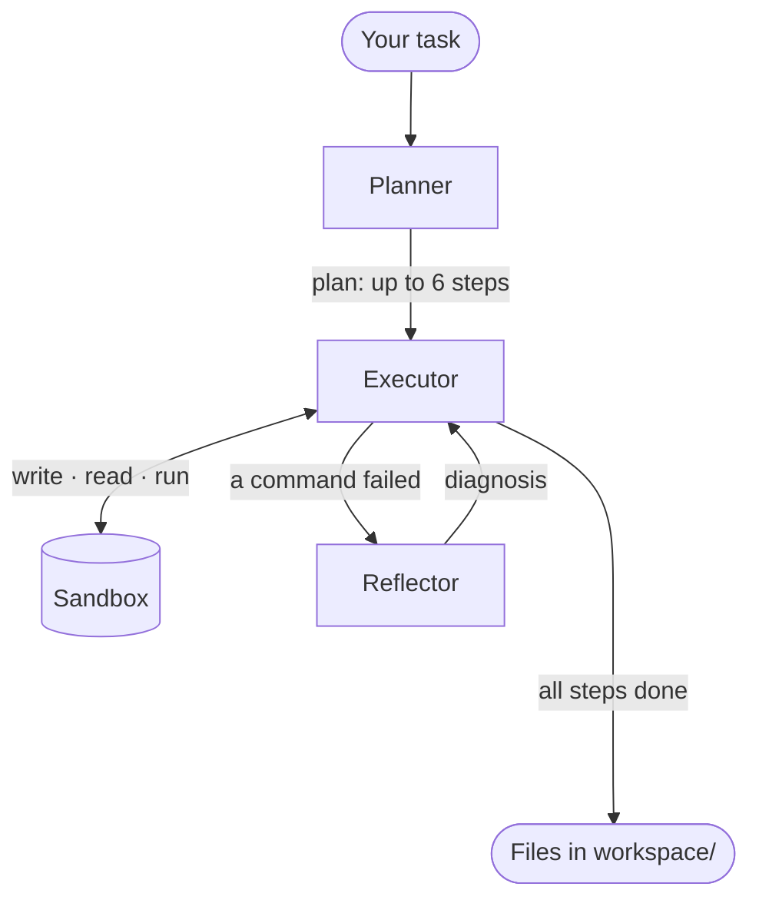

<div align="center">

# 🍴 Project Fork

**An autonomous coding agent that plans, writes, tests and fixes its own code, all inside a sandbox.**

*Next step: fork the sandbox to try several strategies in parallel and keep the one that passes the tests.*


*Built for the **Coding and Agentic Engineering** hackathon track.*

</div>

---

## ✨ What it does

Give Project Fork a task in plain English, for example *"write a function that parses ISO dates, with pytest tests"*. The agent then:

1. 🧭 **Plans:** breaks the task into small steps, each with a success check.
2. 🛠️ **Executes:** writes files and runs commands inside an isolated sandbox.
3. 🔍 **Reflects:** when a command fails, it diagnoses why and remembers which approaches already failed.
4. 🔁 **Recovers:** retries with a different approach and never repeats a known-bad fix.
5. 📦 **Delivers:** copies the finished files into your local `workspace/` folder and logs every action.

## 🧠 How it works



1. **Planner** turns your task into up to 6 small steps, each with a success check.
2. **Executor** works through the steps one at a time, writing files and running commands in the **sandbox**.
3. **Reflector** steps in when a command fails. It explains what went wrong and keeps a list of approaches that already failed, so the executor tries something new.
4. When every step is done, the files are copied to `workspace/` and the whole run is saved to `logs/`.

**Built-in safety**
- 🔒 The agent can't read or write files outside its workspace.
- ⏱️ Each task is capped at **25 model turns**.
- 🧮 Token usage is tracked separately for each stage.
- 💤 If the agent re-runs a failed command without changing any code, the reflector isn't called again, which saves tokens.

## 📦 Sandboxes

Both backends expose the same interface (`start`, `write_file`, `read_file`, `run`, `finish`), so the agent doesn't care which one is running.

| Backend | `SANDBOX=` | Best for |
|---|---|---|
| 🐳 **Docker** *(default)* | `docker` | Free, fast, offline local development. Python 3.12 + pytest with resource limits. |
| ☁️ **Nebius Sandboxes** | `nebius` | VM-isolated cloud runs. Every command is saved as a snapshot you can branch from, which is the basis for parallel forking. |

## 🚀 Quickstart

```bash
# 1. Set up the environment
python -m venv .venv
source .venv/bin/activate          # Windows: .venv\Scripts\activate
pip install -r requirements.txt

# 2. Build the local sandbox image (Docker backend)
docker build -t fork-sandbox sandbox

# 3. Configure your keys and models
cp .env.example .env               # Windows: copy .env.example .env
python list_models.py              # see which models your key can use
python check_connection.py         # quick model round-trip

# 4. Run it
python agent.py                    # terminal
streamlit run app.py               # web UI
```

Generated code is written to `workspace/`, and run logs go to `logs/run_<timestamp>.jsonl`.

## ⚙️ Configuration

Copy `.env.example` to `.env` and fill it in. A typical setup (Nemotron on Nebius, code running in local Docker) needs only four lines:

```ini
PROVIDER=nebius
NEBIUS_API_KEY=your-key-here
NEBIUS_MODEL=a-nemotron-model-from-list_models.py
SANDBOX=docker
```

Everything else is optional.

### 1. Where the model runs

| Variable | Needed when | Default |
|---|---|---|
| `PROVIDER` | always | `ollama` |
| `NEBIUS_API_KEY` | `PROVIDER=nebius` | – |
| `NEBIUS_MODEL` | `PROVIDER=nebius` | – |
| `NEBIUS_BASE_URL` | using a different Nebius region | UK-South endpoint |
| `OPENROUTER_API_KEY`, `OPENROUTER_MODEL` | `PROVIDER=openrouter` | – |
| `OLLAMA_URL`, `OLLAMA_MODEL` | `PROVIDER=ollama` | `http://localhost:11434/v1`, `llama3.1:8b-instruct-q4_K_M` |

### 2. A different model per stage *(optional)*

Leave these blank to use the main model for everything.

| Variable | Used by |
|---|---|
| `PLANNER_MODEL` | Planner |
| `EXECUTOR_MODEL` | Executor |
| `REFLECTOR_MODEL` | Reflector |

### 3. Where the code runs

| Variable | Needed when | Default |
|---|---|---|
| `SANDBOX` | always | `docker` |
| `SANDBOX_IMAGE` | using a custom Docker image | `fork-sandbox` |
| `NEBIUS_PROJECT_ID` | `SANDBOX=nebius` | – |
| `NEBIUS_SANDBOX_IMAGE` | using a custom Nebius image | `python:3.12-slim` |

## 🧪 Tests

```bash
pytest
```

The test suite scripts the model's replies, so it needs **no API key and no network**. It covers the planner, the reflector, the recovery loop, the turn limit, per-stage model routing, token counting and the Nebius backend.

## 🔎 Inspecting a run

```bash
python summarize_log.py                              # latest run
python summarize_log.py logs/run_20260923_131622.jsonl
```

This prints the task, the models used, the plan, each tool call (ok / FAILED) and every reflection.

## 🗂️ Project layout

```
.
├── agent.py              # Planner → Executor → Reflector loop
├── sandboxes.py          # Docker and Nebius sandbox backends
├── app.py                # Streamlit web UI
├── sandbox/dockerfile    # Sandbox image: Python 3.12 + pytest
├── test_agent.py         # Offline test suite
├── summarize_log.py      # Readable summary of a JSONL run log
├── list_models.py        # List models available to your key
├── check_connection.py   # Model connectivity check
└── check_sandbox.py      # Nebius sandbox connectivity check
```

## 🗺️ Roadmap

- [x] Tool-using agent loop (write file, read file, run command)
- [x] Self-correction: runs its own code and fixes errors
- [x] Turn limit and JSONL logging of every action
- [x] Docker sandbox with pytest and resource limits
- [x] Planner and Reflector with structured outputs
- [x] Per-stage models (NVIDIA Nemotron on Nebius Token Factory)
- [x] Nebius Sandboxes backend with snapshots
- [x] Streamlit web interface
- [ ] 🍴 **Parallel branching:** fork Nebius snapshots, try several strategies at once, keep the one that passes
- [ ] Fine-tuned Nemotron executor
- [ ] Benchmark

## 📄 License

[MIT](LICENSE)
